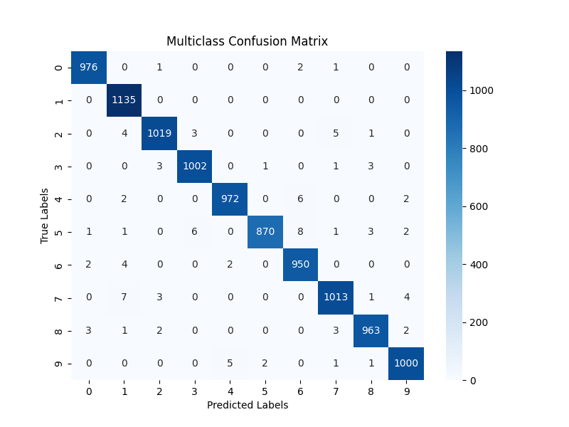
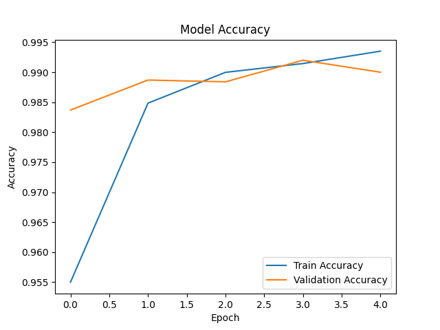
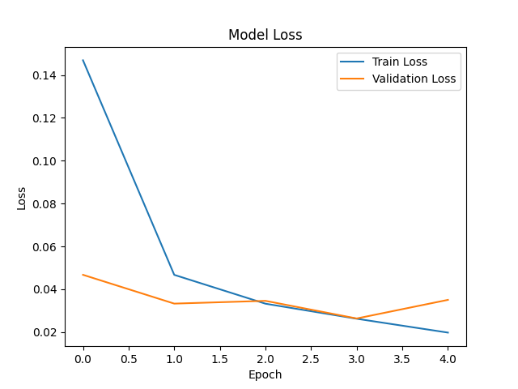

# CNN Classifier
    Projeto da disciplina de Inteligência Artificial (EACH-USP)

O projeto consiste na implementação de uma rede neural convolucional (CNN) em Python, com TensorFlow/Keras. Ele é organizado de forma modular, com funções específicas para carregar e pré-processar dados, construir modelos e treinar/avaliar os modelos.   
O objetivo é realizar duas tarefas de classificação usando o conjunto de dados [MNIST](https://www.tensorflow.org/datasets/catalog/mnist?hl=pt-br):

1. Classificação Multiclasse: Identificar corretamente dígitos de 0 a 9.
2. Classificação Binária: Identificar se é ou não é determinado dígito escolhido.

## Estrutura

- `src`: arquivos .py que fazem o treinamento e avaliação dos modelos da rede neural.
- `plot`: imagens dos gráficos gerandos durante a execucação do projeto.
- `requirements.txt`: arquivo que contém as dependências que serão instaladas para rodar.

## Módulos
### main.py
Responsável por orquestrar todo o processo, desde o carregamento e pré-processamento dos dados até o treinamento e avaliação dos modelos.

### data_preprocess.py
Funções para carregar e pré-processar os dados.  
* `load_and_preprocess_data`: Carrega os dados do MNIST, normaliza os valores das imagens para o intervalo [0, 1] e adiciona uma dimensão extra necessária para a CNN.  
* `filter_binary_classes`: Filtra as imagens e rótulos para conter apenas a classe específica, permitindo a classificação binária.

### train_and_evaluate.py
Função para treinar e avaliar os modelos.  
* `train_and_evaluate`: Treina o modelo com os dados de treinamento e avalia o desempenho nos dados de teste, retornando o histórico de treinamento, a perda e a acurácia de teste.

### cnn_model.py
Funções para construir os modelos de rede neural.  
* `build_multiclass_model`: Cria e compila uma CNN para classificação de 10 classes (dígitos de 0 a 9), com várias camadas convolucionais, de pooling e densas.  
* `build_binary_model`: Cria e compila uma CNN para classificação binária para uma classe específica, com uma estrutura semelhante à do modelo multiclasse, mas com uma camada de saída adaptada para a classificação binária.

### plot.py
Funções para gerar e salvar os gráficos.  
* `plot_confusion_matrix`: Gera e salva um gráfico de matriz de confusão, que ajuda a visualizar o desempenho do modelo em termos de classificações corretas e incorretas. Esse gráfico é apenas para a Validação.
* `plot_accuracy`: Gera e salva um gráfico de precisão ao longo do tempo, mostrando como a precisão do modelo melhora ou piora ao longo das épocas de treinamento. Esse gráfico é gerado para o Treinamento e Validação.
* `plot_loss`: Gera e salva um gráfico de perda ao longo do tempo, mostrando como a perda (erro) do modelo melhora ou piora ao longo das épocas de treinamento. Esse gráfico é gerado para o Treinamento e Validação.

## Fluxo
#### Carregamento e Pré-processamento dos Dados
Os dados do MNIST são carregados e normalizados.  
Para a tarefa binária, os dados são filtrados para avaliar apenas um determinado dígito escolhido pelo usuário.

#### Construção e Treinamento dos Modelos
Um modelo CNN para classificação multiclasse é construído e treinado.
Outro modelo CNN para classificação binária é construído e treinado com os dados filtrados.

#### Avaliação
Ambos os modelos são avaliados com dados de teste para medir seu desempenho.

#### Gráficos
Ao final, são plotados três gráficos para os dois tipos de modelos. Sendo eles: Matriz de Confusão (validação), Erro (treinamento e validação), Acurácia (treinamento e validação). Eles são criados na pasta plot do projeto.

## Run
1. Crie um ambiente virtual e instale as dependências
   ~~~
   sudo apt install python3-venv
   python3 -m venv venv
   source venv/bin/activate
   pip install -r requirements.txt
   ~~~
2. Execute o main
   ~~~
   python src/main.py
   ~~~

## Dependências
Este projeto utiliza várias bibliotecas essenciais em Python para análise de dados, construção de modelos de machine learning e visualização de resultados. Abaixo estão as principais dependências necessárias:

- **[TensorFlow](https://www.tensorflow.org/)**
  - Biblioteca de código aberto da Google para machine learning e deep learning. Ideal para construir e treinar modelos complexos de machine learning.

- **[Matplotlib](https://matplotlib.org/)**
  - Biblioteca gráfica em Python para criação de gráficos 2D. Essencial para visualização de dados através de gráficos detalhados e customizáveis.

- **[scikit-learn](https://scikit-learn.org/stable/)**
  - Biblioteca de machine learning em Python, de código aberto. Oferece ferramentas para análise preditiva, incluindo classificação, regressão e clustering.

- **[NumPy](https://numpy.org/)**
  - Biblioteca fundamental para computação científica em Python. Facilita operações numéricas complexas com arrays multidimensionais.

- **[Seaborn](https://seaborn.pydata.org/)**
  - Biblioteca de visualização de dados baseada em Matplotlib. Permite a criação de gráficos estatísticos atraentes e informativos.

### Exemplos
Abaixo é possível visualizar um exemplo de como ficaram os plots para do treinamento `Multiclasse` realizado para o projeto.

