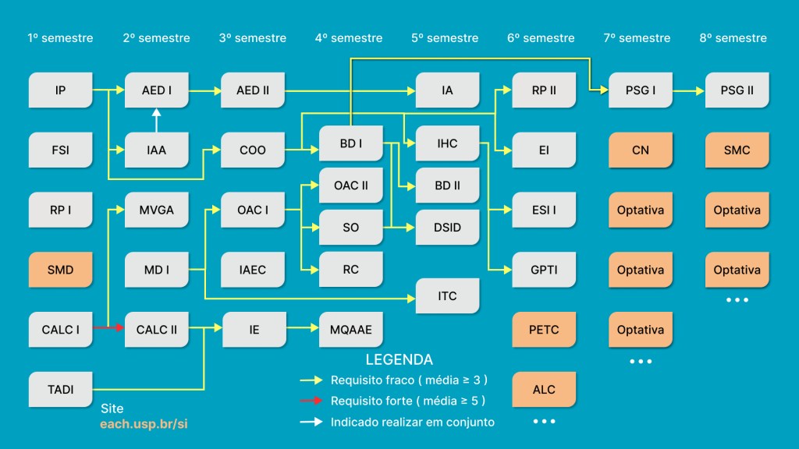

# Sistemas de Informação - EACH USP

Contém todas as disciplinas cursadas durante 6 anos (2019-2024) na graduação de Sistemas de Informação da Universidade de São Paulo.
  - [Bacharelado em Sistemas de Informação](https://www.each.usp.br/si/assets/html/about.html)

## Disciplinas

### `1º ano`
  
1º Semestre:
  - Introdução à Programação (IP)
  - Tratamento e Análise de Dados/ Informações (TADI)
  - Resolução de Problemas I (RP I)
  - Cálculo I (Calc I)
  - Fundamentos de Sistemas de Informação (FSI)
  
2º Semestre:
  - Introdução à Análise de Algoritmos (IAA)
  - Cálculo II (Calc II)
  - Matemática Discreta I (MD I)
  - Algoritmos e Estruturas de Dados I (AED I)
  - Matrizes, Vetores e Geometria Analítica (MVGA)
  
### `2º ano`

3º Semestre:
  - Computação Orientada a Objetos (COO)
  - Algoritmos e Estruturas de Dados II (AED II)
  - Organização e Arquitetura de Computadores I (OAC I)
  - Introdução à Administração e Economia para Computação (IAEC)
  - Introdução à Estatística (IE)

4º Semestre:
  - Banco de Dados I (BD I)
  - Métodos Quantitativos Aplicados à Administração de Empresas I (MQAAE)
  - Redes de Computadores (RC)
  - Sistemas Operacionais (SO)
  - Organização e Arquitetura de Computadores II (OAC II)

### `3º ano`

5º Semestre:
  - Análise, Projeto e Interface Humano-Computador (IHC)
  - Inteligência Artificial (IA)
  - Banco de Dados II (BD II)
  - Introdução à Teoria da Computação (ITC)
  - Desenvolvimento de Sistemas de Informação Distribuídos (DSID)

6º Semestre:
  - Engenharia de Sistemas de Informação I (ESI I)
  - Resolução de Problemas II (RP II)
  - Gestão de Projetos de Tecnologia da Informação (GPTI)
  - Empreendedorismo em Informática (EI)

### `4º ano`

7º Semestre:
  - Projeto Supervisionado ou de Graduação I (PSG I)

8º Semestre:
  - Projeto Supervisionado ou de Graduação II (PSG II)

### `Optativas`

  - Construção de Compiladores (CC)
  - Computação Sônica (CS)
  - Governo Aberto (GA)
  - Segurança da Informação (SI)
  - Tópicos Especiais em Bancos de Dados (TEBD)
  - Análise de Redes Sociais (ARS)
  - Gestão Empresarial (GE)

### `Ciclo Básico`

  - Sociedade, Multiculturalismo e Direitos – Direitos Humanos e Multiculturalismo (SMD)
  - Ciências da Natureza – Ciências da Vida (CN)
  - Psicologia, Educação e Temas Contemporâneos – Uma Visão Psicanalítica (PET)
  - Sociedade, Meio Ambiente e Cidadania – Sociedade, Ambiente e Cidadania (SMC)
  - Arte, Literatura e Cultura – Fantasia e Ficção Científica na Cultura Pop (ALC)

## Grade Curricular

